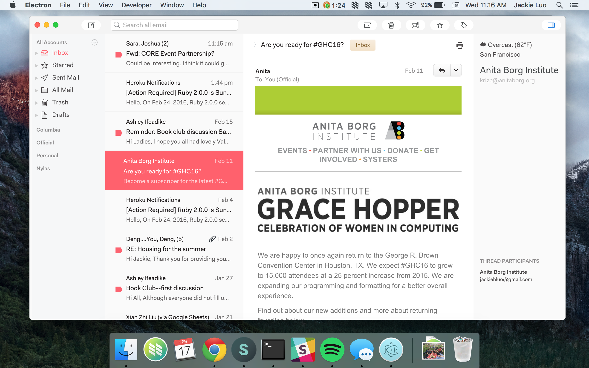

# Weather for N1
A weather plugin for N1.

## Installation
1. Download the Nylas N1 email client!
2. Clone this repo.
3. On the N1 menu, select `Developer > Install a Package Manually...` from the dialog.
4. Find the directory for this plugin to install it. :tada:
